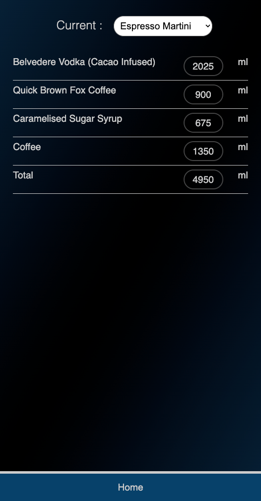
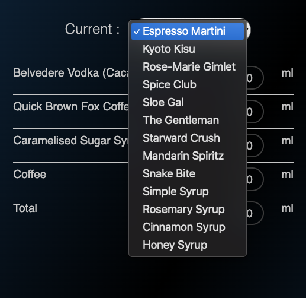
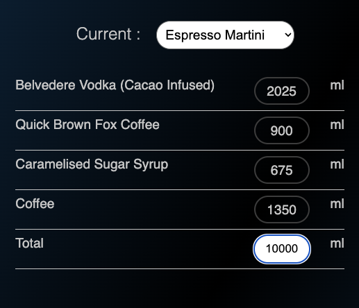

# Batcheehe

[Link for the Demo](https://batcheehe.vercel.app/)

At the point I build this project I was on a transition to the tech industry, and still had a foot on my old career ( Bartending )

Batcheehe was was created to help me on my bartending weekly tasks.

As a weekly routine on my hospitality job, I have to batch several liters of cocktails to be sold through the week. Every week the amounts will depend on how much we have left from previous week.

This tool recalculates the recipes based on two options

1 - The Total amount I want to batch
2 - The Total amount available of one of the ingredients

Sometimes delivery does not come and we need to work with what you have.

The other feature of this tool is that all the recipes are adjusted to a factor that's multiple of 5.
The reason behind that is that this is how most of bars build their recipes and cocktails.
Because of that inputing values like 50 or 70 ml might zero the recipes. But that would defeat the
purpose of the tool anyway. When batching, we want to make at least 2 bottles of batch ( 1400 ml )

With that tool there's no need to worry about all those calculations ( which are prone to error ) and I achieved conscistency across all recipes.

## Images and Usage

### Home Page

### Calculator Page

### Recipes List

### Recalculating

To recalculate a recipe you just need to tap the ingredient you want as the base measure for the recipe.

Or the total amount ( the last item on the recipe )

Change for the value you want and press enter or click somewhere else on the screen.

And that's it.

Things measured in grams that are not sugar will not be added to the final recipe volume, because those are removed after infusion or shaking process.

### Results

